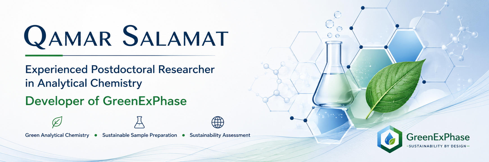

## Bridging Analytical Chemistry and Digital Sustainability

I am an analytical chemist whose research focuses on advancing sustainable analytical chemistry through innovative extraction materials, green sample preparation strategies, and digital scientific tools. My work combines analytical science with computational approaches to develop practical solutions that support evidence-based sustainability assessment and informed decision-making in analytical research.

As the developer of **GreenExPhase**, I am particularly interested in the digital transformation of analytical chemistry by creating scientific software that enables the holistic assessment, comparison, and optimization of extraction phases. My long-term goal is to contribute to more sustainable laboratory practices by integrating rigorous scientific methodologies with intelligent digital technologies.
