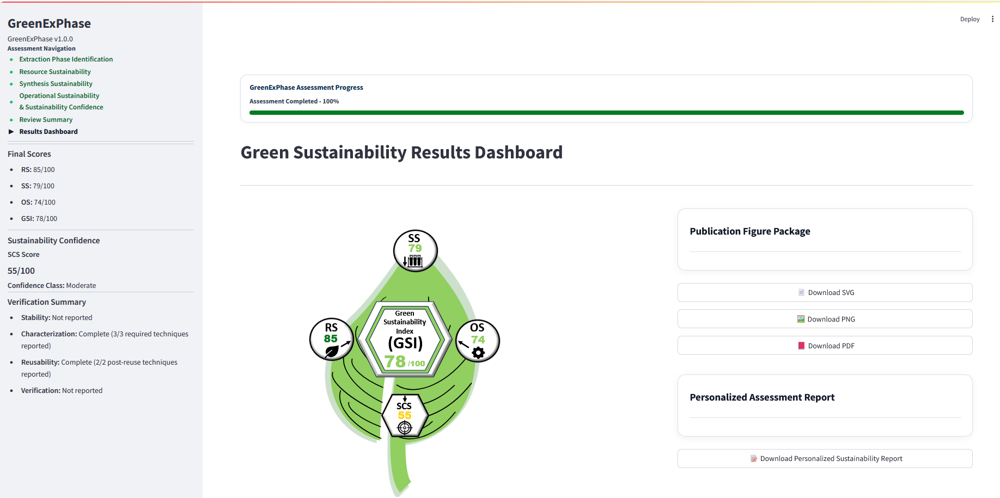

## Advancing Sustainable Analytical Chemistry Through Digital Innovation 

I am an analytical chemist specializing in green analytical chemistry, sustainable sample preparation, and the design of innovative extraction materials and methodologies. My research explores how analytical science can be combined with computational approaches to develop practical tools that improve the sustainability, reliability, and transparency of analytical workflows.

My recent work has expanded toward research software development through the creation of ###`GreenExPhase`###, a scientific platform for the holistic sustainability assessment of extraction phases. By integrating analytical chemistry with digital technologies, I aim to develop reproducible methodologies and intelligent decision-support tools that help researchers design greener analytical systems and accelerate sustainable innovation.

**57+** peer-reviewed publications • **725+** citations • **h-index 16** • **100+** journal peer reviews

---

## 🔬 Research Interests

- **Green Analytical Chemistry**
  - Environmentally responsible analytical methodologies and sustainability-oriented analytical systems

- **Sustainable Sample Preparation**
  - Design and development of sustainable extraction materials and sample preparation platforms, including liquid- and solid-phase systems for analytical applications

- **Scientific Software & Digital Sustainability Assessment**
  - Research software, sustainability assessment, digital decision-support systems, and computational tools for analytical chemistry

- **Analytical Method Development**
  - Electrochemical sensing, spectroscopy, chromatography, and quantitative analytical methodologies
  
---

## 💻 Featured Scientific Software
### `GreenExPhase`

*A digital scientific platform for holistic sustainability assessment, comparison, and decision support in extraction phase development.*
GreenExPhase was developed to address the growing need for standardized, transparent, and reproducible sustainability assessment in extraction science. The platform enables researchers to evaluate extraction phases using structured sustainability criteria and evidence-based decision-support methodologies, facilitating more informed method development and comparison while promoting sustainable analytical chemistry.

| **Attribute** | **Description** |
|---------------|-----------------|
| **Purpose** | Holistic sustainability assessment of extraction phases |
| **Research Domain** | Green Analytical Chemistry & Sustainable Sample Preparation |
| **Core Functions** | Assessment, comparison, visualization, and reporting |
| **Target Users** | Researchers, graduate students, and analytical scientists |
| **Development Status** | Version 1.0 completed |
| **Availability** | Repository currently private. Public demonstration will be released following peer-reviewed publication |

---

### ✅ Key Capabilities

- ✅ Guided project-based sustainability assessment
- ✅ Multi-criteria sustainability scoring
- ✅ Comparative evaluation of extraction phases
- ✅ Interactive visualization and analytical dashboards
- ✅ Automated report generation
- ✅ Transparent documentation of sustainability assessments

---

### 🖼️ Platform Preview

  

*Figure 1. GreenExPhase Results Dashboard illustrating the integrated sustainability assessment, visualization, and decision-support workflow.*

---

## 🧪 Current Research

My current research focuses on advancing sustainable analytical chemistry through the integration of innovative extraction materials, green sample preparation strategies, and digital scientific technologies. I am particularly interested in developing computational frameworks that support evidence-based sustainability assessment and improve decision-making in analytical science.

Current research directions include:

• Computational sustainability assessment for analytical chemistry
• Green extraction materials and sustainable sample preparation
• Scientific software for transparent and reproducible analytical workflows

---

## 🎓 Academic Profiles

My publications, citation metrics, research activities, and professional affiliations can be explored through the following academic platforms:

- **📚 Google Scholar** → [View Profile](https://scholar.google.com/citations?user=cVM-IC8AAAAJ&hl=en&oi=ao/Qamar_Salamat)

- **🆔 ORCID** → [0009-0008-9455-7200](https://orcid.org/0009-0008-9455-7200)

---

## 🤝 Collaboration

I welcome academic collaborations in the following research areas:

• Green Analytical Chemistry
• Sustainable Sample Preparation
• Sustainability Assessment & Decision-Support Systems
• Scientific Software for Analytical Chemistry
• Extraction Materials and Technologies

Researchers interested in collaboration, scientific software, sustainable analytical chemistry, or joint funding proposals are welcome to get in touch.
